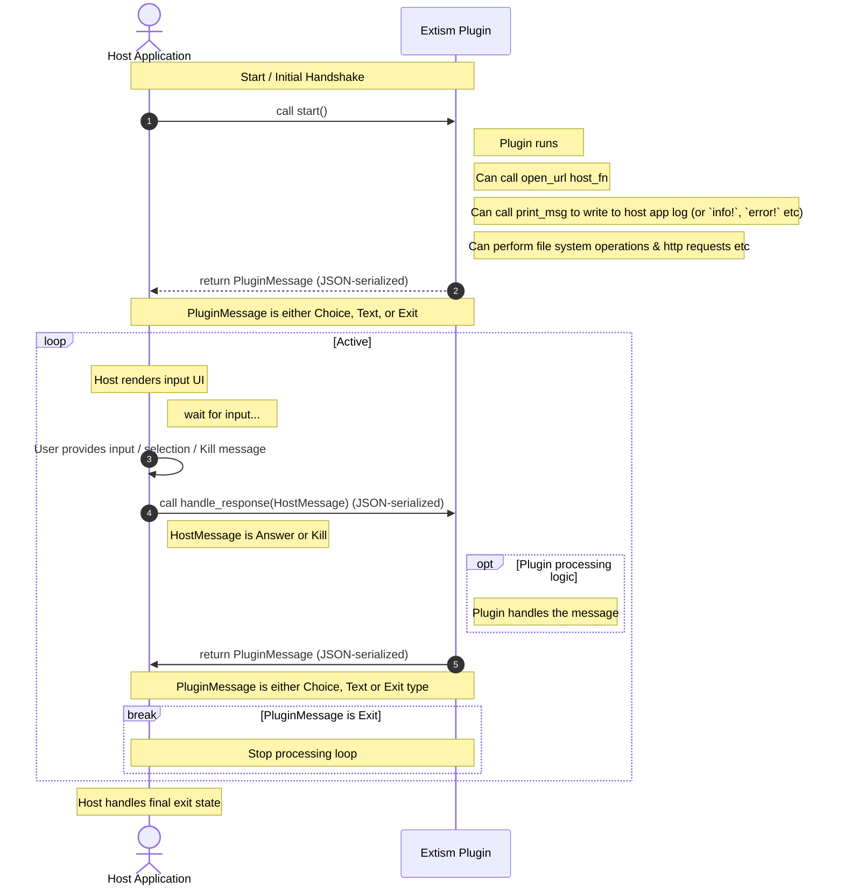

# pocket-plugin
Plugins for Analogue Pocket updaters (Pocket Sync, pupdate) using extism

## To build
You'll need to `rustup target add wasm32-wasip1` if you've not got it already, then
`cargo build -p plugin --target wasm32-wasip1`
Then run
`cargo run -p demo_host -- --folder-plugin ./target/wasm32-wasip1/debug`

(or `cargo build -p plugin --target wasm32-wasip1 && cargo run -p demo_host -- --folder-plugin ./target/wasm32-wasip1/debug`)

should run the example plugin within the demo app.

The demo_host app can be told to look at the actual Pocket SD card, see what's available with `cargo run -p demo_host -- --help`.

The demo host app is more complex than I'd hoped, but most of that's just getting the tokio channels to send data between the task that's running the plugin & the UI one. The actual Plugin running code is fairly simple, I think.

## Flow

The plugin must define at least a `start` `plugin_fn` (no arguments), if it doesn't need to ask the user for input.
If it needs to ask the user for input it'll also need a `handle_response` `plugin_fn` which recieves the `HostMessage` enum, JSON serialised - which can either be a response to a `PluginMessage` that's asked for input, or a signal to kill the plugin.

The host must define a `open_url` `host_fn` which takes a url as a string and should open it in the user's browser.
The host must define a `print_msg` `host_fn` which takes a message as a string and should log it (acts like `print` rather than `println` so the plugin has to care about newlines etc).

The host should respond to the 3 possible `PluginMessage` options (`Choice`, `Text`, `Exit`) by:
- rendering UI with a multiple choice
- rendering UI for a free text prompt
- letting the user know the plugin's finished (or whatever makes sense, returning the user to the main app etc)

## TODO
- [x] Sketch out host_fns & plugin_fns
- [x] Rough Demo & app
- [x] Add another folder accessible by the plugin on the host machine (empy folder, sub-directory on the app directory, exposed as `computer/` or something)
- [x] Tidy this up generally
- [x] Add logic & schema for the JSON file that'll be beside a plugin that tells us the name, a description, what hosts it wants to access (with a wildcard option) etc
- [] Document how the Plugin system works for non-Rust plugins (not 100% sure how the enums are encoded etc)
- [] Generate a schema https://github.com/extism/rust-pdk#generating-bindings

## Unknowns
- We could show the plugin individual folders for Games / Saves / Cores etc, but I don't think this would give us much
