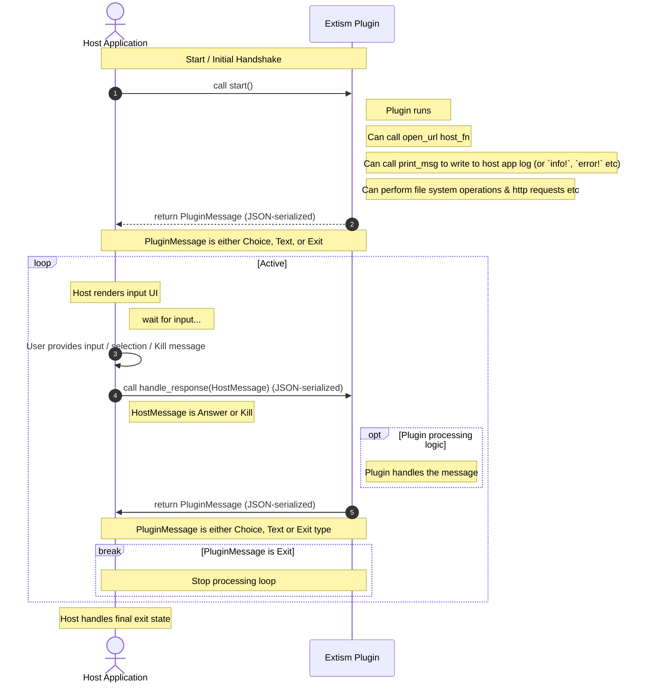

# pocket-plugin
Plugins for Analogue Pocket updaters (Pocket Sync, pupdate) using extism

## What can be done with a Pocket Plugin?

- Create, read, write, list, and modify arbitrary files on the Pocket, with full access to the pocket's filesystem
- Run exactly the same plugin in pupdate, Pocket Sync, and any other app that comes along.
- Make HTTP requests from the plugin (using extism's `http` module)
- Store files & cache on the user's computer, in a sandboxed folder dedicated to the plugin
- Print log information to the user as the plugin processes
- Ask for 2 types of input from the user - multiple choice (for menus etc) & free text input (for keys, tokens, etc)
- Open urls in the user's browser (to confirm an upload happened, open a key management portal, etc)

## Tips

- Because WASM & Extism plugins are single threaded there's a few things to consider:
  - If you want to download big files without having the user think they're stalled consider downloading them in chunks using range headers & showing progress via the log.
  - There isn't a nice way to gracefully shut down the WASM plugin mid-way, so write defensively (e.g. if a file named `file.txt` is being modified; first copy it to `file_copy.txt`, do the modifications, then rename `file_copy.txt` to `file.txt`)
  - The host app will handle notifying the WASM app that the user's chosen to quit (via the `Kill` HostMessage), but the Plugin won't actually quit until the Plugin returns the `Exit` PluginMessage so any confirmation / clean up etc can happen
- Use the `print()` host_fn often so the user knows the plugin is running - note that this is a `print` rather than a `println` so the app should ouput `this is a log.\n`.
- The `PluginMessage` & `HostMessage` are Rust enums, encoded into JSON by serde using the [deafult externally tagged representation](https://serde.rs/enum-representations.html#externally-tagged) so you will get `HostMessages` that look like
```json
{"Answer": {"name": "...", "value": "..."}}
```
or
```json
{"Kill": {}}
```

## To build
You'll need to `rustup target add wasm32-wasip1` if you've not got it already, then
`cargo build -p plugin --target wasm32-wasip1`
Then run
`cargo run -p demo_host -- --folder-plugin ./target/wasm32-wasip1/debug`

(or `cargo build -p plugin --target wasm32-wasip1 && cargo run -p demo_host -- --folder-plugin ./target/wasm32-wasip1/debug`)

should run the example plugin within the demo app.

The demo_host app can be told to look at the actual Pocket SD card, see what's available with `cargo run -p demo_host -- --help`.

The demo host app is more complex than I'd hoped, but most of that's just getting the tokio channels to send data between the task that's running the plugin & the UI one. The actual Plugin running code is fairly simple, I think.

## To test other plugins

Use the `demo_host` here to test other plugins via `cargo run -p demo_host -- --folder-plugin [your folder contaning the wasm & json file] --log-level trace`.

(note for non-rust devs, run `cargo clean` after you're done since Rust will casually eat up gigabytes worth of space storing build assets etc)

## To release

To release a plugin create a github repo that has releases which contain `plugin.wasm` & `plugin.json` files [like this repo does](https://github.com/openfpga-library/pocket-plugin/releases/tag/v0.0.2) (other non-github platforms might be supported in the future).

To tell users about the plugin give them the repo link e.g. `https://github.com/openfpga-library/pocket-plugin` and the host apps will look up the latest release, find the json & wasm, load them for the user, and keep them up to date (using the release title as the version number).

## Flow

The plugin must define at least a `start` `plugin_fn` (no arguments), if it doesn't need to ask the user for input.
If it needs to ask the user for input it'll also need a `handle_response` `plugin_fn` which recieves the `HostMessage` enum, JSON serialised - which can either be a response to a `PluginMessage` that's asked for input, or a signal to kill the plugin.

The host must define a `open_url` `host_fn` which takes a url as a string and should open it in the user's browser.
The host must define a `print_msg` `host_fn` which takes a message as a string and should log it (acts like `print` rather than `println` so the plugin has to care about newlines etc).

The host should respond to the 3 possible `PluginMessage` options (`Choice`, `Text`, `Exit`) by:
- rendering UI with a multiple choice
- rendering UI for a free text prompt
- letting the user know the plugin's finished (or whatever makes sense, returning the user to the main app etc)



## TODO
- [x] Sketch out host_fns & plugin_fns
- [x] Rough Demo & app
- [x] Add another folder accessible by the plugin on the host machine (empy folder, sub-directory on the app directory, exposed as `computer/` or something)
- [x] Tidy this up generally
- [x] Add logic & schema for the JSON file that'll be beside a plugin that tells us the name, a description, what hosts it wants to access (with a wildcard option) etc
- [x] Document how the Plugin system works for non-Rust plugins (not 100% sure how the enums are encoded etc)
- [ ] ~~Generate a schema https://github.com/extism/rust-pdk#generating-bindings~~ looks like v1 of this is still a draft, maybe later
